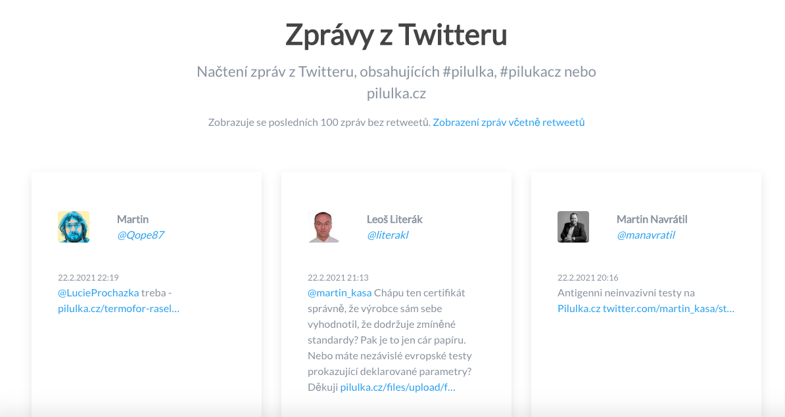

# Twitter test

Načtení zpráv z Twitteru, obsahujících #pilulka, #pilukacz nebo pilulka.cz

## Postup instalace

1. naklonování repozitáře 
```
git clone https://github.com/cedrik75/twitter-test.git
```

2. přepnutí se do složky s projektem
```
cd twitter-test
```

3. instalace knihoven pomocí Composeru
```
composer install
```

4. doménu nasměrujte do rootu projektu

##  Screenshot

